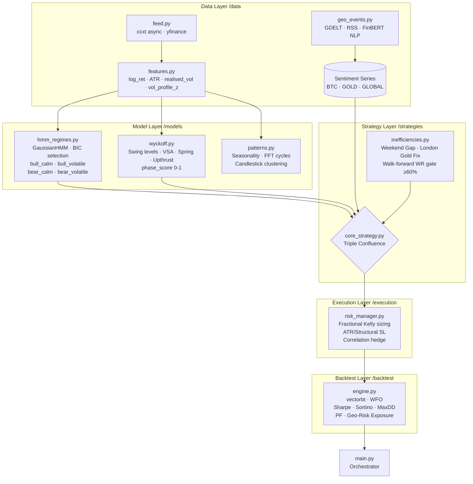

# hmm — Quantitative Trading Bot

[](https://www.python.org/)
[](LICENSE)

Quantitative trading system for **BTC/USDT** and **XAUUSD (Gold)** built on the convergence of Hidden Markov Models, Wyckoff market structure, geopolitical sentiment and temporal market inefficiencies.

---

## Architecture



---

## Mathematical Components

### Hidden Markov Model (HMM)
- **Model**: `hmmlearn.GaussianHMM` with `full` covariance matrix.
- **Observation space** (4-D): `[log_return, realised_volatility, ATR_norm, volume_profile_z_score]`
- **Regime count K**: selected via **Bayesian Information Criterion (BIC)** over K ∈ [2, 8].
- **BIC formula**: `BIC = -2·LL + K_params · ln(T)` where `K_params = K(K-1) + KD + KD(D+1)/2`.
- **Regime decoding**: Viterbi algorithm for full-sequence MAP estimate; forward-algorithm for bar-by-bar posteriors.

### Wyckoff VSA
- **Effort vs. Result**: `ER = sign(close−open) · spread / volume`. Near-zero ER at high volume = institutional absorption.
- **Phase scoring**: composite of price-quartile position, absorption score, and rate-of-change — output in [0, 1].
- **Spring / Upthrust**: detected when wick transiently breaches a structural level but closes on the opposite side (within `wick_tolerance`).

### Fractional Kelly Criterion
```
f* = (p·b − q) / b           where b = avg_win / avg_loss
f_frac = f* × kelly_fraction  (default: 0.25)
f_capped = min(f_frac, max_risk_pct)   (hard cap: 2% NAV)
```

### Dynamic Stop Loss
> **RULE**: Stop loss placement is anchored exclusively to structural market levels (swing highs/lows) or ATR-derived volatility bands. There is no breakeven or arbitrary move-to-entry logic.

Priority:
1. **Structural**: nearest swing low/high within 1.5×ATR of entry ± buffer.
2. **ATR-based**: `entry ± (multiplier × ATR)`, with multiplier widened ×1.5 in `bear_volatile` regime.
3. **Trailing**: SL can only move to reduce risk (one-directional).

---

## Project Structure

```
hmm/
├── config.py              # Pydantic-Settings singleton
├── main.py                # Pipeline orchestrator
├── requirements.txt
├── pyproject.toml
├── .env.example
│
├── data/
│   ├── feed.py            # Async OHLCV connectors (ccxt / yfinance)
│   ├── features.py        # Feature engineering pipeline
│   └── geo_events.py      # Geopolitical sentiment (GDELT + RSS + FinBERT)
│
├── models/
│   ├── hmm_regimes.py     # GaussianHMM regime detector
│   ├── wyckoff.py         # Wyckoff phase & event detection
│   └── patterns.py        # Seasonality · FFT cycles · candle clustering
│
├── strategies/
│   ├── core_strategy.py   # Triple-confluence entry logic
│   └── inefficiencies.py  # Weekend gap · London Gold Fix · WR gate
│
├── execution/
│   └── risk_manager.py    # Kelly sizer · Dynamic SL · Hedge manager
│
├── backtest/
│   └── engine.py          # vectorbt backtest + WFO
│
├── notebooks/
│   └── 01_hmm_btc_vs_gold_eda.ipynb
│
└── tests/
    └── test_core.py
```

---

## Installation

### 1. Clone the repository
```bash
git clone https://github.com/nicots85/hmm.git
cd hmm
```

### 2. Create a Python 3.11+ virtual environment
```bash
python3.11 -m venv .venv
source .venv/bin/activate
```

### 3. Install dependencies
```bash
pip install --upgrade pip
pip install -r requirements.txt
```

> **TA-Lib**: requires the C library. On Ubuntu: `sudo apt-get install -y ta-lib`. If unavailable, the system falls back to `pandas-ta`.

### 4. Configure environment variables
```bash
cp .env.example .env
# Edit .env and populate your API keys
```

---

## Usage

### Run the full pipeline (backtest mode)
```bash
python main.py --mode backtest --asset all
```

### Run for a single asset
```bash
python main.py --mode backtest --asset BTC
```

### Run tests
```bash
pytest tests/ -v
```

### Run tests with coverage
```bash
pytest tests/ -v --cov=. --cov-report=term-missing
```

---

## Configuration Reference

All parameters are set in `.env` (see `.env.example`). Key values:

| Variable | Default | Description |
|---|---|---|
| `HMM_N_COMPONENTS` | 4 | Latent regime count (overridden by BIC selection) |
| `ATR_PERIOD` | 14 | Wilder ATR smoothing period |
| `KELLY_FRACTION` | 0.25 | Fractional Kelly multiplier |
| `MAX_POSITION_RISK_PCT` | 0.02 | Max % of NAV per trade |
| `HEDGE_CORRELATION_WINDOW` | 30 | Rolling window (days) for BTC/Gold correlation |
| `BACKTEST_START` | 2020-01-01 | Backtest start date |
| `BACKTEST_END` | 2024-12-31 | Backtest end date |

---

## Risk Disclaimer

This software is for educational and research purposes. Trading financial instruments involves substantial risk of loss. Past backtest performance does not guarantee future results. Never risk capital you cannot afford to lose.
